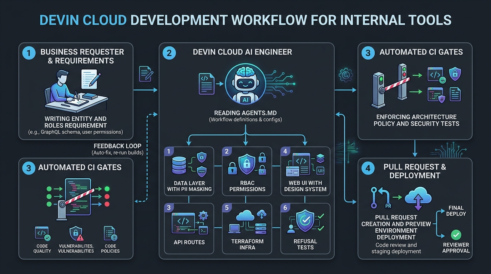

# Paved road — internal tools prototype

Build the tools as fast as you can with reusing the shared platform and data models

## Background

A prototype that answers one question: **what does the *next* internal tool cost?**

Power Apps makes tool #1 cheap. The argument for owning the stack only works if tool #11
is cheaper still, and that depends entirely on what a new tool inherits rather than
rebuilds. So this repository is a shared platform plus four tools built on it, and the
interesting number is not the first one.

## How to create a new tool

1. Clone this repository to your repo
2. Connect your repo to devin
3. Describe the tool in business terms and devin cloud finishes the rest!
4. Check the output and fix the spec of app with devin until it meets

### Example of prompts to create new one

A usable request states the entity, who may see it, who may change it, and what must be
recorded. Everything else is the platform's problem:

> A queue of GDPR data-subject requests against existing customers. Support can see the
> queue but not close anything; data stewards and compliance admins can resolve a request
> with a note. Region scoping and PII masking as everywhere else. 30-day SLA, flag the
> breaches, and every read and resolution must be in the audit log.

Note what is absent: no login, no roles table, no masking rules, no audit plumbing, no
deployment. Asking for those is a sign the request is being over-specified.

### The image of Devin Cloud Development Workflow



The loop between Devin Cloud and CI is self-correcting: if Devin attempts to write raw SQL
in an app or forgets PII masking, the architecture policy and refusal test suite fail the build,
forcing Devin back onto the paved road before human review.

### Output
#### 1. Data

```
db/migrations/00X_<entity>.sql      # the raw data schema
packages/data/src/<entity>.ts       # queries + its FieldPolicy
```

The access module declares which columns are PII and applies the region scope; tools call
it and never write SQL, so masking and row-level scope cannot be forgotten in a template.

for example:

```ts
const DSAR_FIELD_POLICY = { full_name: "pii", email: "pii" } as const;
// every read returns applyFieldPolicy(row, DSAR_FIELD_POLICY, principal)
```

#### 2. Permissions

Add the permission and give it to roles in `packages/platform/src/rbac.ts`:

```ts
type Permission = ... | "dsar:read" | "dsar:resolve";

support:            [... "dsar:read"]                 // may watch the queue, not close it
"data-steward":     [... "dsar:read", "dsar:resolve"]
"kyc-reviewer":     [...]                             // omitted → refused, silently and by default
```

A role that is not listed is refused. New tools are deny-by-default without the tool
containing any authorization logic.

#### 3. API

```
apps/<tool>/api/src/server.ts   # loadConfig + createService + buildApp + listen (~20 lines, copy it)
apps/<tool>/api/src/app.ts      # routes only
```

Each route names the permission it needs and records what it did:

```ts
app.post("/api/requests/:id/resolution", requirePermission("dsar:resolve"), async (req, res, next) => {
  const { resolution, note } = resolutionBody.parse(req.body);   // your domain rules
  const row = await resolveRequest(db, req.principal!, id, resolution, note);
  await req.audit({ action: "dsar.request.resolve", resourceType: "dsar_request", resourceId: id });
  res.json(row);
});
```

If you catch yourself writing `jwtVerify`, importing `pg`, or reading a cookie: stop. The
`policy` CI job fails the build, and the thing you need belongs in `packages/platform` so
every tool gets it.

#### 4. Web

```
apps/<tool>/web/app/layout.tsx providers.tsx page.tsx
```

Build screens from `AppShell`, `DataTable`, `FilterBar`, `Card`, `DetailList`, `Pill`,
`Button` and the inputs. `IfPermitted` hides actions the user cannot take — remember that
hiding is cosmetic and the API is what actually refuses. Needing a new primitive is fine;
put it in `packages/ui` so tool #12 inherits it.

#### 5. Infra

```hcl
# infra/variables.tf
<tool> = { api_port = 400X, web_port = 300X }
```

plus an OIDC client in `services/idp`, two `dev:` scripts in `package.json`, and a test
file asserting who is refused — the 403s and the out-of-region 404, not just the happy
path. Then `npm run lint && npm run typecheck && npm test`, and open a PR.

Last and most important: give the tool a **named owner** in the catalogue. A tool without
one is the failure mode this platform exists to prevent.


## What is shared vs. what a tool writes

| Capability | Lives in | A tool writes |
|---|---|---|
| OIDC login, PKCE, session cookie | `packages/platform` | nothing |
| Groups → roles → permissions | `packages/platform/src/rbac.ts` | a permission name per route |
| Row-level region scope | `packages/platform` + `packages/data` | nothing |
| Field-level PII masking | `packages/platform/src/field-policy.ts` | a field classification, once per entity |
| Audit log (append-only) | `packages/platform/src/audit.ts` | one `req.audit({...})` per meaningful action |
| Created apps data access | `packages/data` | a query call |
| Grids, filters, forms, detail panes, app shell | `packages/ui` | composition |
| Container topology, environments | `infra/` | a map entry in `infra/variables.tf` |
| Authorization + policy gate | `.github/workflows/ci.yml` | nothing |

The four tools as examples:

- **`apps/customer-console`** — tool #1. Search, list, detail, edit and note customer
  records, with PII masking and region scoping.
- **`apps/kyc-queue`** — tool #2. A review queue over the same customers: filter by risk
  and status, open a case with its documents, record a decision with a reason.
- **`apps/dsar-console`** — tool #3. A data-subject-request queue: filter by status, type
  and SLA breach, open a request, resolve it with a note.
- **`apps/complaints-desk`** — tool #4. A complaints queue with an eight-week final-response
  clock: support logs a complaint, data stewards and compliance admins close it with an
  outcome.


## Run it locally

Requires Node 22 and Docker.

```bash
docker run -d --name paved-pg -e POSTGRES_PASSWORD=devpass -e POSTGRES_USER=devuser \
  -e POSTGRES_DB=paved -p 5432:5432 postgres:16

cp .env.example .env
npm install
npm run build:packages
npm run db:reset     # migrate + seed 120 synthetic customers, KYC cases, DSARs and complaints
npm run dev          # local IdP + every API + every front end
```

| Service | URL |
|---|---|
| Customer console | http://localhost:3001 |
| KYC review queue | http://localhost:3002 |
| Data subject requests | http://localhost:3003 |
| Complaints desk | http://localhost:3004 |
| Local OIDC provider | http://localhost:9000 |

### Test users

The local provider accepts **any password**. It exists to prove the OIDC wiring and the
group→role mapping; it is not an identity service and must never run outside dev/CI.

| Sign in as | Groups | Sees |
|---|---|---|
| `sam.support@example-synthetic.test` | `internal-support`, `region-EMEA` | EMEA customers, DSARs and complaints, all PII masked, no edit, no KYC; can log a complaint but not close one, cannot resolve a DSAR |
| `dana.steward@example-synthetic.test` | `data-stewards`, `region-global` | every region, PII in the clear, can edit, resolve DSARs and close complaints — but no KYC decisions |
| `ken.reviewer@example-synthetic.test` | `kyc-reviewers`, `region-APAC` | APAC KYC cases only, can decide; no DSAR or complaint access |
| `avery.admin@example-synthetic.test` | `compliance-admins`, `region-global` | everything, including the audit log |

Roles come from directory groups only. There is no user-role table to drift, and no
in-app admin screen that can grant someone a permission the directory did not.

## Verify it

```bash
npm run lint
npm run typecheck
npm test          # 55 tests: authorization, region scope, PII masking, audit
```

The tests are the point of the CI gate: they assert that a support user cannot write, that
a regional user gets a 404 rather than a redaction for out-of-region rows, that the audit
log rejects `UPDATE` and `DELETE` at the database level, and that every denial is recorded.
A second CI job fails the build if a tool imports `pg` or touches a session cookie directly.


## Deliberately not here

No production data or PII, no money movement, no refunds tool, no Power Apps cutover, no
production hardening, no DR drill, no on-call. The local IdP proves the wiring, not an
integration with a corporate directory. See `docs/RESULTS.md` for what this does and does
not prove.
